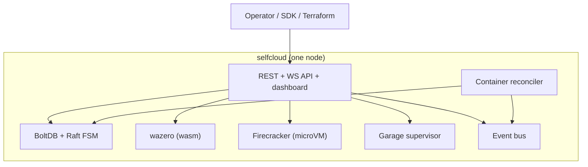

# selfCloud

A self-hostable, fully-featured cloud platform with a one-line setup. Manage S3-compatible object storage, serverless functions, and containers from a single web dashboard or with Terraform.

## Quick start

```bash
curl -fsSL https://get.selfcloud.dev | sh
```

The installer verifies the host (`selfcloud doctor --preflight`),
downloads the binary plus its `.sha256`, renders a systemd unit, and
waits for `/readyz` to go green. It then prints the dashboard URL and
a one-time bootstrap token. Open the URL in your browser, paste the
token, finish the first-run wizard, and you have a private cloud
running on a single machine. Add more machines from the dashboard
later when you need them.

## What's in the box

| Capability | Backed by | Notes |
|---|---|---|
| Object storage (S3 API) | [Garage](https://garagehq.deuxfleurs.fr) | Single-node by default, expands to a multi-zone cluster from the dashboard |
| Containers | containerd | OCI images, bridge networking, port publishing, volumes, resource limits, restart policies, live log streaming, exec |
| Wasm functions | wazero (pure Go, WASI Preview 1) | Sub-10ms cold starts, HTTP and cron triggers, language-agnostic stdin/stdout JSON ABI, secret files at `/secrets/` |
| MicroVM functions | Firecracker | Any-language functions, snapshot/restore for warm starts, secret files at `/run/selfcloud/secrets/` |
| Web dashboard | React + Vite + Tailwind | Embedded into the Go binary, no separate hosting needed |
| Infra-as-Code | Terraform provider | Same REST API the dashboard uses |
| Cluster | Raft + BoltDB FSM | Leader-redirect on followers; writes replicate via Raft Apply |

## Architecture at a glance

selfCloud is a single static Go binary (`selfcloud`). One copy per machine. The first machine becomes the control-plane leader; additional machines `selfcloud join` into a Raft cluster. State is stored in an embedded BoltDB-backed Raft FSM; cluster-wide writes go through the Raft log. Workloads (containers, functions, S3 buckets) are reconciled from desired state on every node.



## Documentation

Full docs live under [`docs/`](docs/README.md):

- [Architecture](docs/architecture.md), [Install](docs/install.md), [Upgrade](docs/upgrade.md)
- [CLI reference](docs/cli.md), [REST API](docs/api.md), [Terraform provider](docs/terraform.md)
- [Containers](docs/containers.md), [Functions](docs/functions.md), [Storage](docs/storage.md), [Events](docs/events.md), [Secrets](docs/secrets.md)
- [Troubleshooting](docs/troubleshooting.md), [Contributing](docs/contributing.md)

## Repository layout

```
cmd/selfcloud/                  single binary entrypoint, Cobra subcommands
internal/api/                   REST + gRPC handlers, OpenAPI spec
internal/auth/                  local users, API tokens, bootstrap token
internal/store/                 Raft FSM over BoltDB, resource CRUD, ReplicatedStore
internal/scheduler/             placement decisions
internal/runtime/container/     containerd client wrapper (volumes, resources, restart)
internal/runtime/wasm/          wazero function runtime + warm pool
internal/runtime/firecracker/   Firecracker microVM runtime + in-guest agent
internal/runtime/functions/     git push-to-deploy builder
internal/storage/garage/        Garage process supervisor + admin client
internal/network/               bridge + nftables port publishing
internal/cluster/               join tokens, add-node flow
internal/events/                event bus, rule dispatcher, log scanner, sidecar
internal/secrets/               AES-GCM encryption, master.key handling
internal/installer/             bootstrap (TLS, systemd unit rendering)
web/                            React + Vite + Tailwind dashboard
terraform-provider-selfcloud/   Terraform provider
docs/                           operator + user docs
install.sh                      curl|sh entrypoint
```

## Building from source

Requirements: Go 1.23+, Bun (or Node 20+), make, Linux x86_64 or arm64 (target host).

```bash
make all          # build the dashboard, embed it, build the binary
./bin/selfcloud server --data-dir ./data
```

## Status

This is the v0 implementation of the [selfCloud Platform Plan](docs/architecture.md). The phased roadmap (containers → S3 → Wasm functions → Firecracker → Terraform → multi-node) is now feature-complete; remaining work is about polish, observability, and ecosystem integrations.

## License

Apache-2.0.
