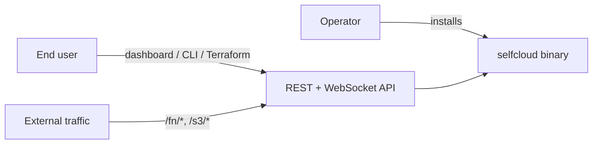
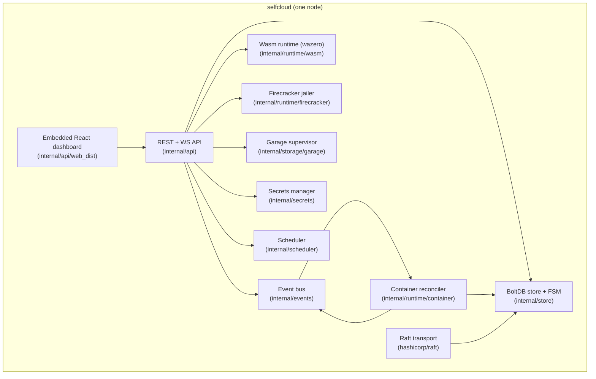
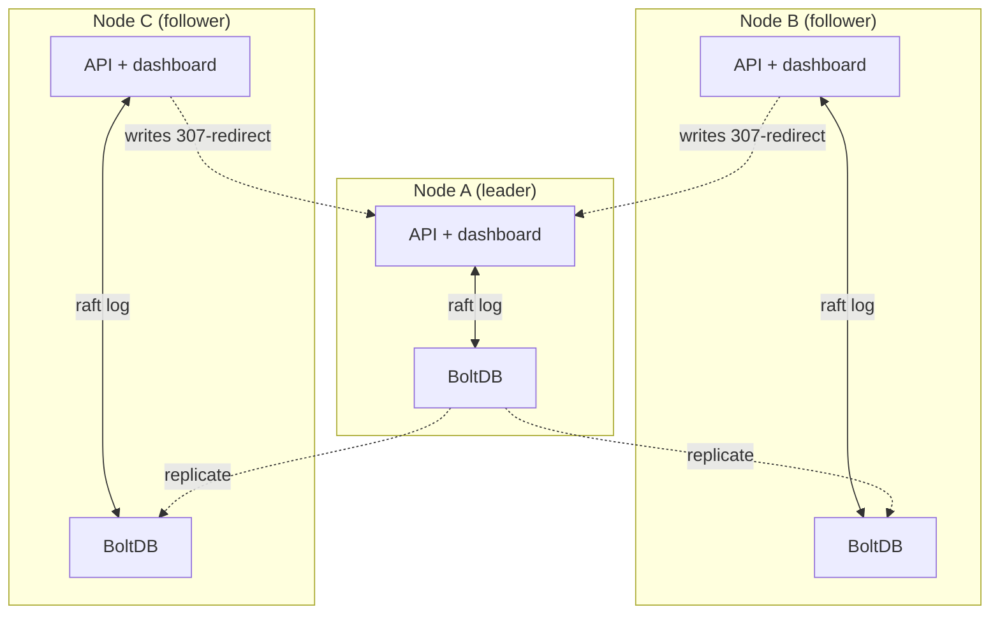
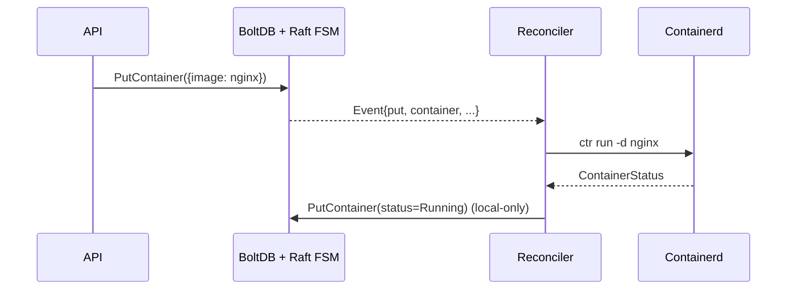
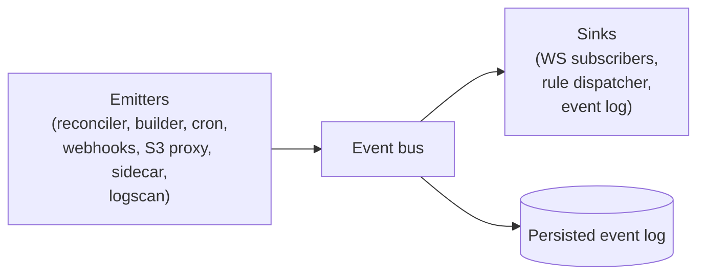

# Architecture

selfCloud is one Go binary. Each machine runs the same `selfcloud`
process; the cluster's truth lives in a Raft log replicated across
control-plane nodes; workloads (containers, functions, S3 buckets) are
reconciled from that desired state on every node.

## Single-binary, three audiences



The same binary serves the dashboard, the REST API, the S3 reverse
proxy, the function HTTP ingress, the Raft transport, and the
reconcilers. There is nothing else to install.

## Components on one node



## Cluster topology

A single-node deployment has one voter; multi-node deployments add
voters via `selfcloud join`. Every supported write goes through Raft so
followers converge on the same state.



Reads are served locally on every node (BoltDB is fast; eventual
consistency is acceptable for the few seconds it takes a Raft entry to
commit). Writes are taken by the leader; followers respond `307 Temporary
Redirect` to the leader's API so dashboards / CLIs / Terraform retry
against the right node automatically.

## Desired state and reconciliation

selfCloud is fundamentally a desired-state system: every workload type
has a typed record in BoltDB (`store.Container`, `store.Function`,
`store.Bucket`, `store.Secret`, `store.EventRule`, ...). Each node's
reconciler subscribes to store events plus a 10s tick and converges its
local runtime to match.



## Event bus

Container lifecycle, function invocations, S3 puts/deletes, cron fires,
build progress, and the in-app sidecar all emit `store.EventRecord`s on
the same bus. The `RuleDispatcher` matches each event against the
configured `EventRule`s and fires their sinks (webhook / invoke
function / container action).



## Repository layout

```
cmd/selfcloud/                  single binary entrypoint, Cobra subcommands
internal/api/                   REST + gRPC handlers, dashboard embed
internal/auth/                  local users, API tokens, bootstrap token
internal/store/                 Raft FSM over BoltDB, resource CRUD
internal/scheduler/             placement decisions
internal/runtime/container/     containerd v2 client wrapper (ctr)
internal/runtime/wasm/          wazero function runtime + warm pool
internal/runtime/firecracker/   Firecracker microVM runtime + agent
internal/runtime/functions/     git push-to-deploy builder
internal/storage/garage/        Garage process supervisor + admin client
internal/network/               bridge + nftables port publishing
internal/cluster/               join tokens, add-node flow
internal/events/                event bus, rule dispatcher, log scanner
internal/secrets/               AES-GCM encryption, master.key handling
internal/installer/             TLS bootstrap, systemd unit rendering
web/                            React + Vite + Tailwind dashboard
terraform-provider-selfcloud/   Terraform provider
docs/                           this directory
install.sh                      curl|sh entrypoint
```
