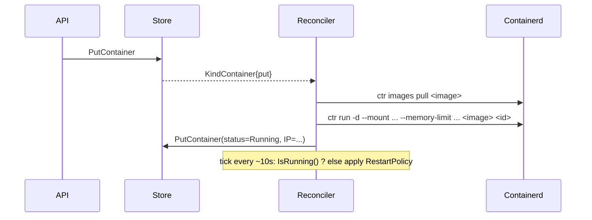

# Containers

selfCloud runs OCI containers via the host's containerd. Each container
is a typed, desired-state record; the per-node reconciler keeps
containerd in sync with that record.

## Quick start

Dashboard → **Containers** → **New container**, or:

```bash
selfcloud containers ls
selfcloud ctl apply /api/v1/projects/default/containers -f - <<'JSON'
{
  "meta": { "name": "hello" },
  "image": "nginxdemos/hello:plain-text",
  "ports": [{ "host": 8081, "container": 80, "protocol": "tcp" }],
  "restartPolicy": "Always"
}
JSON
```

## Spec reference

`store.Container` (`internal/store/types.go`):

| Field | Notes |
|---|---|
| `meta.project`, `meta.name` | unique within a project |
| `image` | OCI ref. The reconciler `ctr images pull`s it on first start |
| `command`, `args` | override the image's entrypoint / cmd |
| `env` | map. Values may be `secret://name` to reference project secrets |
| `ports` | host-port publishing via nftables DNAT |
| `volumes` | bind mounts (`bucket` for S3-backed mounts is reserved for future use) |
| `secretMounts` | resolved secrets projected as env (`envName`) or files (`mountPath`) |
| `restartPolicy` | `Never`, `OnFailure`, `Always` — checked by the reconciler every ~10s |
| `resources` | `cpuMillicores`, `memoryMB` — translated to `--cpu-quota` / `--memory-limit` |
| `nodeId` | placement target. Leave blank to let the scheduler pick |
| `status` | reconciler-owned. Phase, message, IP, containerd id |

## Lifecycle



`Stop` keeps the container in `PhaseStopped`; the reconciler treats
that as terminal until you `Start` again. `Delete` removes both the
record and the running task.

## Logs and exec

```
GET  /api/v1/projects/{p}/containers/{name}/logs              short, plain text
GET  /api/v1/projects/{p}/containers/{name}/logs/ws           streaming
GET  /api/v1/projects/{p}/containers/{name}/exec              websocket TTY
```

Streaming is real-time (`ctr tasks attach` piped through stdout) — the
v0 fallback to `ctr tasks ls` is gone.

## Secrets

`secretMounts` lets you reference a project Secret without ever passing
plaintext through the API. Two flavours:

- `envName`: the resolved value lands in the container's environment
  under that variable name.
- `mountPath`: the resolved value is staged at
  `<dataDir>/secret-mounts/<container-uid>/<basename>` on the host (mode
  0600) and bind-mounted into the container at `mountPath` read-only.

Reference style 1 in `env`:

```json
"env": { "STRIPE_KEY": "secret://stripe-prod" }
```

Reference style 2 via `secretMounts`:

```json
"secretMounts": [
  { "secret": "stripe-prod", "mountPath": "/run/secrets/stripe.key" }
]
```

## Networking

Each container gets a bridge interface (`selfcloud0`, default subnet
`10.42.0.0/16`). When `IPAddress` is observed in status and `ports`
are declared, the network manager publishes the host port via
nftables DNAT. Removing a container `Unpublish`es it.

If `nft` isn't on the host, port publishing is a no-op (the dashboard
shows the container as Running but external traffic won't reach it
without a manual hop).
