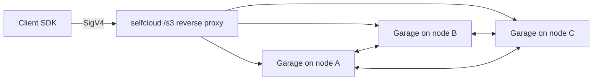

# Storage (S3-compatible)

selfCloud's S3 surface is [Garage](https://garagehq.deuxfleurs.fr) under
the hood. Each node runs its own Garage process, supervised by
selfcloud, with cluster-wide RPC + admin secrets shared via the join
handshake.

## Buckets

```bash
selfcloud ctl apply /api/v1/projects/default/buckets -f - <<'JSON'
{
  "meta": { "name": "uploads" },
  "region": "us-east-1",
  "versioning": false,
  "websiteAccess": false
}
JSON
```

The `garageId` is filled in by the API after Garage creates the bucket.

## Access keys

```bash
curl -fsSk https://localhost:8443/api/v1/projects/default/access-keys \
  -H "authorization: Bearer $TOKEN" \
  -H "content-type: application/json" \
  -d '{"name":"uploader","bucket":"uploads","permissions":"write"}'
```

`permissions`: `read` | `write` | `owner`. The secret is returned **only
once** at create time.

## Speaking S3

Two endpoints serve S3 traffic:

- The Garage S3 listener directly: `http://<host>:3900/<bucket>/<key>`
  (default; controlled by `--s3-addr`).
- The selfcloud-proxied listener: `https://<host>:8443/s3/<bucket>/<key>`.
  This is where dashboard-side uploads go and where successful
  PUT/DELETE traffic emits `s3.put` / `s3.delete` events for the rule
  engine.

Either way, sign the request with the access key + secret using SigV4
(`region` defaults to whatever you set on the bucket).

```python
import boto3
s3 = boto3.client("s3",
    endpoint_url="https://your-selfcloud:8443/s3",
    aws_access_key_id="...",
    aws_secret_access_key="...",
    region_name="us-east-1",
    verify=False)  # self-signed
s3.put_object(Bucket="uploads", Key="hello.txt", Body=b"hi")
```

## Single-node vs multi-node

On a single-node deployment, Garage runs with `--single-node`. The API
calls `EnsureLayout` once on first ready so the local node owns the
single zone.

On multi-node, the dashboard owns layout: under **Settings → Cluster
mode** flip Multi-node and set the desired replication factor. Each
node's Garage joins the cluster automatically using the RPC secret +
admin token transferred via `selfcloud join`.



## Object browser

The dashboard's bucket detail view talks to the S3 admin bridge
(`internal/api/objects.go`) using the cluster-internal access key
provisioned at first boot. Use it for ad-hoc uploads / downloads /
deletes; for production traffic, point your SDK directly at `/s3/...`.
